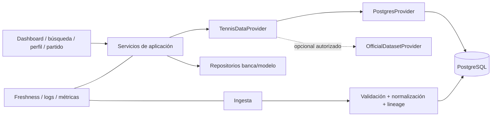

# Arquitectura objetivo incremental

## Principios

Mantener Astro/React/Tailwind/PostgreSQL/Vercel. Separar proveedor, normalización, persistencia, consulta y presentación. Cada dato debe llevar fuente, captura, freshness y calidad.



## Contrato

```ts
interface TennisDataProvider {
  capabilities(): Promise<ProviderCapabilities>;
  getPlayerProfile(id: PlayerId): Promise<DataResult<PlayerProfile>>;
  getPlayerRankings(id: PlayerId, range?: DateRange): Promise<DataResult<RankingPoint[]>>;
  getPlayerElo(id: PlayerId, at?: string): Promise<DataResult<EloRating | null>>;
  getSurfaceElo(id: PlayerId, surface: Surface, at?: string): Promise<DataResult<EloRating | null>>;
  getMatchHistory(id: PlayerId, query?: MatchHistoryQuery): Promise<DataResult<Match[]>>;
  getPlayerSplits(id: PlayerId, query?: SplitQuery): Promise<DataResult<PlayerSplits>>;
  getHeadToHead(a: PlayerId, b: PlayerId): Promise<DataResult<HeadToHead>>;
  getTournament(id: TournamentId): Promise<DataResult<Tournament>>;
  getSchedule(query: ScheduleQuery): Promise<DataResult<Match[]>>;
  getLiveMatch(id: MatchId): Promise<DataResult<LiveMatch | null>>;
}
```

`DataResult` incluye `data`, `source`, `capturedAt`, `observedAt`, `freshness`, `quality`, `licenseRef`, `warnings` y `missingFields`. Capabilities evitan que la UI invente soporte.

## Hallazgos/decisiones

| Severidad | Evidencia | Archivo/módulo | Impacto | Recomendación | Esfuerzo | Riesgo cambio | Prioridad |
|---|---|---|---|---|---|---|---|
| Alta | UI consulta helpers concretos y esquema | `queries.ts`, pages | Cambio de fuente costoso | Introducir provider sobre consultas actuales, sin migración big-bang | Medio | Bajo | P1 |
| Alta | Banca sin frontera de identidad | APIs/esquema | No escalable multiusuario | Auth/ownership como carril separado previo a “Mi Tenismo” | Alto | Alto | P0 |
| Media | Live y schedule tienen capacidades diferentes | ESPN/DB | UI puede prometer campos inexistentes | Capabilities + estados missing explícitos | Bajo | Bajo | P1 |
